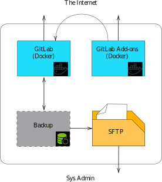
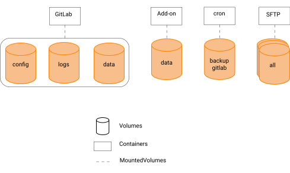

# Ticketing
Ticketing system for Banana.ch website

# Introduction
The final choice on the product to be implemented in order to develop an efficient Ticketing System is to use GitLab. Although it is not commonly used for this kind of task, it was chosen by the company for its simplicity and versatility. Among the capabilities that were more requested, there are:

- The implementation of a feature that classifies the requests by the language in which they are written in. For that purpose, we consider the languages covered by the assistance system (as of Oct. 2020, Italian, English, Portuguese, French, Spanish, Dutch, Chinese, German).
- The inclusion of a solid and efficient back-up system.  
- The inclusion of an efficient _knowledge base_ system based on the Wiki model in order to provide to the support team an easy way to access precompiled drafts for common questions.
- The implementation of a virtual assistant powered by an appositely designed AI.

# Docker
## Introduction Scheme

## Containers

# Backup
Even though backups are possible in the default version of GitLab, they require to be performed manually. To overcome this, an apposite script has been implemented.

# ChatBox

ChatBox is the name of the virtual assistant (also known as _chat-bot_) that has been implemented.
The ChatBox is used to detect the language in which a message is written and can
automatically answer to some common questions.
